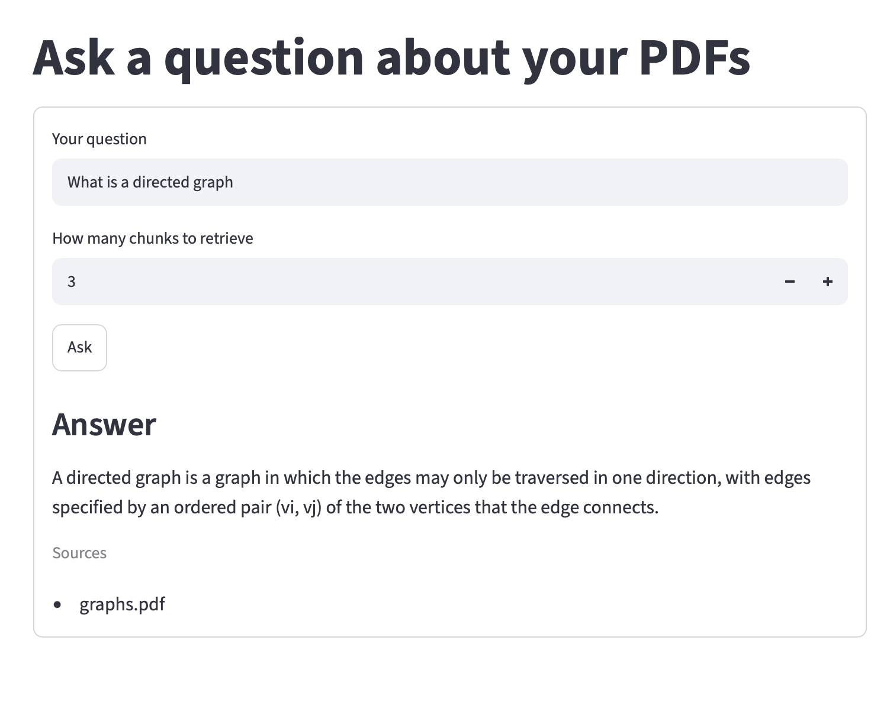
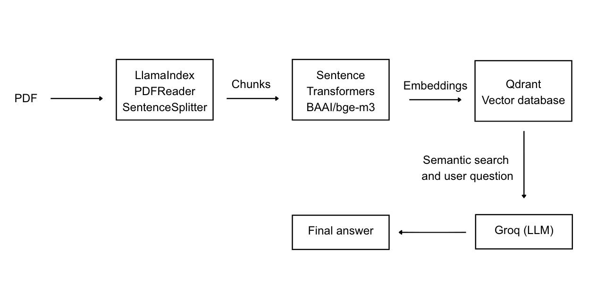

# RAG Assistant

## About the project
### 1. Description

This project was developed with the aim of getting familiar with the RAG systems and their workflow.

Retrieval augmented generation is one of the most used technologies nowadays and therefore knowledge on the matter seems essential to the software development and computer science world.

This project is a great but simple way of getting started with RAG and can be modified to include more complex features.

### 2. Technologies used
[![Python][Python]][Python-url]
[![FastAPI][FastAPI]][FastAPI-url]
[![Streamlit][Streamlit]][Streamlit-url]
[![Qdrant][Qdrant]][Qdrant-url]
[![Groq][Groq]][Groq-url]
[![SentenceTransformers][SentenceTransformers]][SentenceTransformers-url]
[![LlamaIndex][LlamaIndex]][LlamaIndex-url]
[![Inngest][Inngest]][Inngest-url]
[![PyPDF2][PyPDF2]][PyPDF2-url]

### 3. Usage

1. Upload a PDF.
2. Wait until ingestion finishes.
3. Ask questions about the uploaded documents.
4. The application retrieves the most relevant chunks and generates an answer using Groq.


#### Example response
## Example Response


### 4. Project Structure

```text
.
├── frontend.py
├── main.py
├── custom_types.py
├── requirements.txt
├── qdrant_storage/
│   ├── data_loader.py
│   └── vector_db.py
└── uploads/
```

#### Workflow


### 5. Installation

### Getting started

Clone the repository:

```bash
git clone https://github.com/alexandracuetom/RAG.git
cd RAG
```

Create a virtual environment and activate it.

```bash
python3 -m venv .venv
```

Install dependencies:

```bash
pip install -r requirements.txt
```


### Environment Variables

Create a `.env` file:

```env
GROQ_API_KEY=YOUR_KEY_HERE

QDRANT_URL=YOUR_URL_HERE
QDRANT_API_KEY=YOUR_KEY_HERE

INNGEST_API_BASE=http://127.0.0.1:8288/v1
```


### Running Qdrant

Using Docker:

```bash
docker run -p 6333:6333 qdrant/qdrant
```

### Running the Application

#### 1. Start the FastAPI server

```bash
uvicorn main:app --reload
```

#### 2. Start the Inngest Dev Server

```bash
npx inngest-cli@latest dev
```


#### 3. Start Streamlit

```bash
streamlit run frontend.py
```

## Resources used

Below are linked all the extra resources along with the documentation used for the dvelopment of this project.

### Main tutorial

* [How to Build a Production-Ready RAG AI Agent in Python (Step-by-Step)](https://youtu.be/AUQJ9eeP-Ls?si=lRhqOOtgzvatnF9p)

### Other resources

* [FastAPI Introduction (GeeksforGeeks)](https://www.geeksforgeeks.org/python/introduction-to-fastapi/)

* [FastAPI Tutorial (GeeksforGeeks)](https://www.geeksforgeeks.org/python/fastapi-tutorial/)

* [Python dotenv 1.2.2 Documentation](https://pypi.org/project/python-dotenv/)


<!-- MARKDOWN LINKS  -->
[Python]: https://img.shields.io/badge/Python-3776AB?style=for-the-badge&logo=python&logoColor=white
[Python-url]: https://www.python.org/

[FastAPI]: https://img.shields.io/badge/FastAPI-009688?style=for-the-badge&logo=fastapi&logoColor=white
[FastAPI-url]: https://fastapi.tiangolo.com/

[Streamlit]: https://img.shields.io/badge/Streamlit-FF4B4B?style=for-the-badge&logo=streamlit&logoColor=white
[Streamlit-url]: https://streamlit.io/

[Qdrant]: https://img.shields.io/badge/Qdrant-DC244C?style=for-the-badge&logo=qdrant&logoColor=white
[Qdrant-url]: https://qdrant.tech/

[Groq]: https://img.shields.io/badge/Groq-F55036?style=for-the-badge&logo=groq&logoColor=white
[Groq-url]: https://groq.com/

[SentenceTransformers]: https://img.shields.io/badge/Sentence%20Transformers-FFD21E?style=for-the-badge&logo=huggingface&logoColor=black
[SentenceTransformers-url]: https://www.sbert.net/

[LlamaIndex]: https://img.shields.io/badge/LlamaIndex-8A2BE2?style=for-the-badge&logo=llama&logoColor=white
[LlamaIndex-url]: https://www.llamaindex.ai/

[Inngest]: https://img.shields.io/badge/Inngest-000000?style=for-the-badge&logo=inngest&logoColor=white
[Inngest-url]: https://www.inngest.com/

[PyPDF2]: https://img.shields.io/badge/PyPDF2-CC0000?style=for-the-badge&logo=adobeacrobatreader&logoColor=white
[PyPDF2-url]: https://pypdf2.readthedocs.io/

[Docker]: https://img.shields.io/badge/Docker-2496ED?style=for-the-badge&logo=docker&logoColor=white
[Docker-url]: https://www.docker.com/
